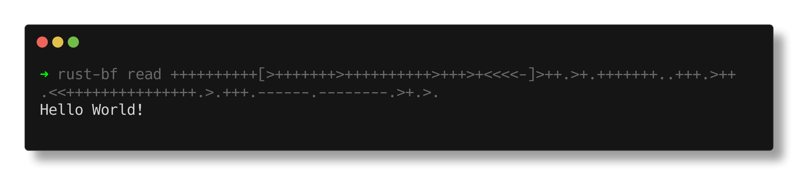
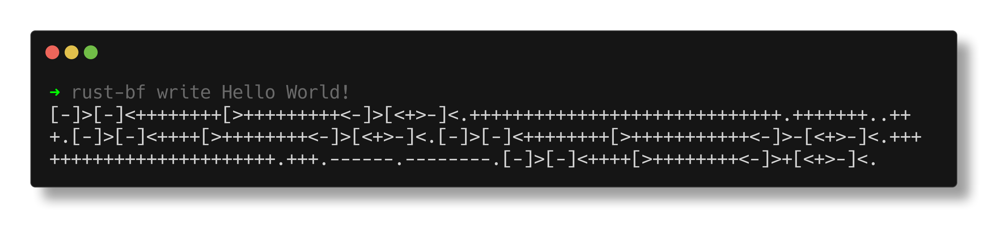
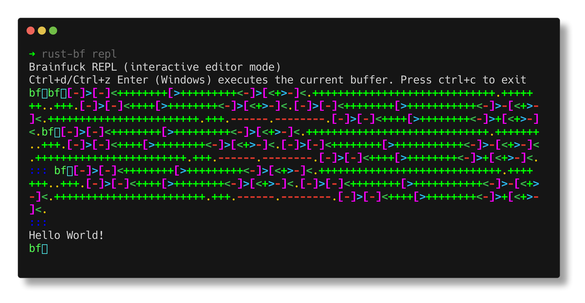
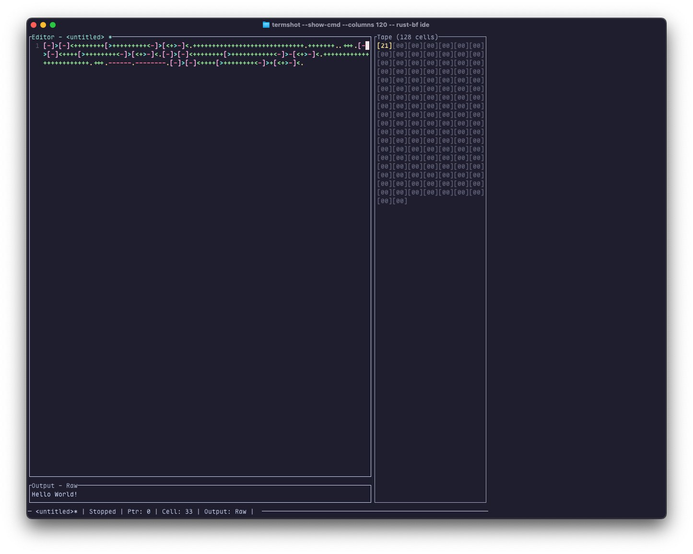

# rust-bf

A Brainfuck interpreter written in Rust, exposed as a library, a reader, a writer, a REPL, and an IDE.

- Memory tape defaults to 30,000 cells initialized to 0
- Strict pointer bounds (moving left of 0 or beyond the last cell is an error)
- Input `,` reads a single byte from stdin (EOF sets current cell to 0)
- Output `.` prints the byte as a character (no newline); the CLI appends a trailing newline for readability
- Proper handling of nested loops `[]`; unmatched brackets are an error
- Any non-Brainfuck character results in an error
- Arithmetic wraps at 8 bits (`u8`) for `+` and `-`
- Debug mode (`--debug` or `-d`) prints a step-by-step execution table instead of performing I/O
- Configurable memory size, execution timeout, and step limit
- Color theme support
- REPL with multi-line editing, command history, meta-commands, and non-blocking execution
- Generates Brainfuck code to print given input (text or raw bytes)
- Comprehensive error handling with descriptive messages
- Unit and integration tests included

## Install / Build

To install the CLI tool, you can use Cargo:

```sh
cargo install --locked rust-bf
```

If you want to build from source:

- Build: `cargo build`
- Run tests: `cargo test`
- Run example: `cargo run --example usage`

## CLI usage (read)

The `read` command interprets and runs Brainfuck code. It prints a trailing newline after execution.



Flags:
- `--debug` or `-d`: run in debug mode (prints a step-by-step table)
- `--memory <size>` or `-m <size>`: set custom memory tape size (default: 30,000 cells)
- `--max-steps <steps>` or `-s <steps>`: limit execution to a maximum number of steps (default: unlimited)
- `--timeout <seconds>` or `-t <seconds>`: limit execution time (default: unlimited)
- `--help` or `-h`: show help information

Env vars:
- `BF_TIMEOUT`: set default timeout in seconds (overridden by `--timeout`)
- `BF_MAX_STEPS`: set default max steps (overridden by `--max-steps`)

Examples:

- Hello World
  - `cargo run -- read "++++++++++[>+++++++>++++++++++>+++>+<<<<-]>++.>+.+++++++..+++.>++.<<+++++++++++++++.>.+++.
  ------.--------.>+.>."`

- Echo a single byte from stdin (",.")
  - `printf 'Z' | cargo run -- read ",."`
  - Output: `Z` followed by a newline from the CLI

- Debug mode (prints a table instead of executing I/O)
  - `cargo run -- read --debug ">+.<"`
  - Useful for understanding control flow; `,` behaves as EOF (cell set to 0) and `.` output is suppressed

- From a file
  - `cargo run -- read --file ./hello.bf`

- From a file with custom memory size and max steps
  - `cargo run -- read --file ./hello.bf --memory 10000 --max-steps 100000`

- From a file with a timeout of 2 seconds
  - `cargo run -- read --file ./hello.bf --timeout 2`

Notes:
- Non-Brainfuck characters cause an error.
- Unmatched `[` or `]` cause an error.
- Moving the pointer out of bounds causes an error.

## CLI usage (write)

Generate Brainfuck code that prints the provided input.



Examples:
- From positional args (recommended with Cargo; note the `--` separator):
  - `cargo run -- write "Hello world"`
- From STDIN (UTF-8 text):
  - `echo -n 'Hello' | cargo run --bin bf -- write`
- From a file:
  - `cargo run -- write --file ./message.txt`
- Raw bytes from a file:
  - `cargo run -- write --bytes --file ./image.bin`

The output is Brainfuck code printed to stdout (a trailing newline is added for readability).

## CLI usage (REPL)

Interactive REPL for Brainfuck code execution.



- Start the REPL:
  - `cargo run -- repl`
- Type Brainfuck code directly into the REPL.
- Invalid instructions are ignored.
- Tape and pointer are reset for each execution. No state is maintained.
- Press Ctrl-D (Unix/macOS) or Ctrl-Z and then Enter (Windows) to signal EOF and execute the code.
- Alt-Up/Down and Ctrl-Up/Down navigate command history.
- The REPL will print the output of the Brainfuck program.
- Press Ctrl-C to exit the REPL immediately with exit code 0.

### REPL Features

- Multi-line buffer editing
- Non-blocking execution
  - Configurable with environment variables:
    - `BF_REPL_TIMEOUT` - max execution time in seconds (default: 2,000)
    - `BF_REPL_MAX_STEPS` - max execution steps (default: unlimited)
  - Default timeout: 2,000 seconds, default max steps: unlimited
- Command history (up/down arrows on a blank buffer)
- Meta-commands (start with `:`):
    - `:help` - show help
    - `:exit` - exit the REPL
    - `:reset` - clear the current buffer
    - `:dump` - print the current buffer
        - add `-n` to print line numbers
        - add `-stderr` to send everything to stderr

### REPL modes and I/O policy

Submission model and Ctrl-C
- Edit a multi-line buffer; Enter inserts a newline.
- Submit the buffer by sending EOF:
    - macOS/Linux: Ctrl-D
    - Windows: Ctrl-Z then Enter
- Ctrl-C exits immediately and cleanly with exit code 0 (does not submit the buffer).

Stream separation
- Program output (produced by your Brainfuck code): stdout only.
- REPL/meta output (prompt, help, errors, :dump framing): stderr.
- `:dump` defaults: content to stdout, framing to stderr; flags can change this (see below).

Modes and navigation
- Edit mode (default):
    - Up/Down move within the multi-line buffer.
    - At the very start of the buffer (row 0, col 0), pressing Up enters History-Browse.
- History-Browse:
    - Up/Down navigate past submissions.
    - Enter accepts the selected entry into the buffer (returns to Edit).
    - Esc cancels browsing and restores your in-progress edits (returns to Edit).
    - Shortcuts: Alt-Up/Down and Ctrl-Up/Down also navigate history (when supported by your terminal).

Interactive vs bare mode
- Auto-detect:
    - If stdin is a TTY: start the interactive editor REPL.
    - If stdin is not a TTY (piped/redirected): bare mode — read all input once, execute, exit 0.
- Flags:
    - `--bare` (alias: `--non-interactive`): force bare mode even on a TTY.
    - `--editor`: force interactive mode; on non-TTY stdin prints an error to stderr and exits 1.
- Prompt suppression: if stderr is not a TTY, prompts/banners are suppressed to keep pipeline output clean.

Timeouts and step limits
- Defaults (interactive REPL):
    - Timeout: 2,000 seconds
    - Max steps: unlimited
- Configuration:
    - CLI flags (on the repl command): --timeout <seconds>, --max-steps <steps>
    - Env vars: BF_REPL_TIMEOUT (seconds), BF_REPL_MAX_STEPS
    - Precedence: CLI flags > environment variables > defaults
- Behavior:
    - If the step limit is exceeded: “Execution aborted: step limit exceeded (N).”
    - If the timeout is exceeded: “Execution aborted: wall-clock timeout (T s).”

Meta commands (start a line with “:”)
- `:exit` — Exit immediately with code 0.
- `:help` — Show key bindings, modes, EOF per OS, timeout/step-limit policy, and examples.
- `:reset` — Clear the current buffer; history is unchanged.
- `:dump` — Print the current buffer for inspection.
    - Defaults: raw content to stdout; framing markers to stderr.
    - Flags:
        - `-n` — include line numbers (stdout)
        - `--stderr` — send everything (content + framing) to stderr
- Examples:
    - `:dump`
    - `:dump -n`
    - `:dump --stderr`

Key bindings (quick reference)
- Cursor: Left/Right within a line; Up/Down within the buffer.
- History-Browse:
    - Enter at (0,0) after Up: accept history item to buffer.
    - Esc: leave history, restore your edits.
    - Up/Down or Alt/Ctrl + Up/Down: move through history.
- Submission: EOF (Ctrl-D on macOS/Linux; Ctrl-Z then Enter on Windows).
- Exit: Ctrl-C (immediate), or :exit.

## CLI usage (IDE)

IDE for Brainfuck code authoring.



- Start the IDE:
    - `cargo run -- ide`
    - `cargo run -- ide --file ./example.bf` to open a file on startup
- Type Brainfuck code directly into the IDE.
- Invalid instructions are ignored.
- Tape and pointer are reset for each execution. No state is maintained.
- Tab to switch focus between editor, output, and tape panes.
- Ctrl-R to execute the editor buffer.
- Ctrl-C to exit the IDE immediately with exit code 0.
- Ctrl-L to toggle line numbers.
- Ctrl-S to save the current buffer to a file.
- Ctrl-O to open a file into the current buffer.
- Ctrl-N to create a new file (prompts to save if the current buffer is dirty).
- Ctrl-P to navigate to the matching bracket (if on a `[` or `]`).
- Ctrl-Q to quit (prompts to save if the current buffer is dirty).
- Ctrl-H / F1 to show help overlay with keybindings and behaviors.

## Color themes

Create the file `~/.config/bf.toml`. Customize with your selected ANSI colors.

Here's the default theme:

```toml
[colors]
editor_title_focused = "cyan"        # Editor pane title when focused
editor_title_unfocused = "gray"      # Editor pane title when unfocused
gutter_text = "darkgray"             # Gutter (line numbers) text color

output_title_focused = "cyan"        # Output pane title when focused
output_title_unfocused = "gray"      # Output pane title when unfocused

tape_border_focused = "cyan"         # Tape pane border when focused
tape_border_unfocused = "gray"       # Tape pane border when unfocused
tape_cell_empty = "darkgray"         # Empty tape cell (0)
tape_cell_nonzero = "white"          # Non-zero tape cell
tape_cell_pointer = "yellow"         # Current cell (pointer)

status_text = "white"                # Status bar text color
dialog_title = "white"               # Dialog title text color
dialog_bg = "black"                  # Dialog background color
dialog_error = "red"                 # Error dialog text color
dialog_text = "white"                # Dialog normal text color
help_hint = "gray"                   # Help hint text color

editor_op_right = "cyan"             # '>'
editor_op_left = "green"             # '<'
editor_op_inc = "lightgreen"         # '+'
editor_op_dec = "red"                # '-'
editor_op_output = "yellow"          # '.'
editor_op_input = "magenta"          # ','
editor_op_bracket = "lightmagenta"   # '[' or ']'
editor_non_bf = "gray"               # non-Brainfuck characters
```

## Library usage

Add this crate to your project. Then:

```rust,no_run
use rust_bf::Brainfuck;

fn main() -> Result<(), Box<dyn std::error::Error>> {
    // Classic Hello World
    let code = "++++++++++[>+++++++>++++++++++>+++>+<<<<-]>++.>+.+++++++..+++.>++.<<+++++++++++++++.>.+++.------.--------.>+.>.";
    let mut bf = Brainfuck::new(code.to_string());
    bf.run()?;
    println!(); // optional: newline for readability
    Ok(())
}
```

Debug run (no real I/O; prints a table):

```rust,no_run
use rust_bf::Brainfuck;

fn main() -> Result<(), Box<dyn std::error::Error>> {
    let code = ">+.<"; // simple program
    let mut bf = Brainfuck::new(code.to_string());
    bf.run_debug()?; // prints a step-by-step table
    Ok(())
}
```

### Custom memory size

```rust,no_run
use rust_bf::Brainfuck;
let mut bf = Brainfuck::new_with_memory(
    "+>+<[->+<]".to_string(),
    1024, // custom tape size
);
let _ = bf.run();
```

## Behavior details

- Input `,`: reads exactly one byte from stdin. On EOF, sets current cell to `0`.
- Output `.`: prints the current cell as a `char` (no newline).
- Pointer `>` / `<`: moving beyond the tape bounds returns `PointerOutOfBounds`.
- Brackets: a pre-pass validates matching pairs; unmatched pairs produce `UnmatchedBrackets`.
- Invalid chars: any char not in `><+-.,[]` produces `InvalidCharacter`.
- I/O errors: wrapped as `IoError(std::io::Error)`.

## Testing

- Unit tests live in `src/lib.rs`.
- Integration tests:
  - `tests/stdin_read.rs` verifies stdin handling for the CLI
  - `tests/debug_flag.rs` verifies the `--debug` table output
- Run all tests with: `cargo test`

## Examples

- `examples/usage.rs` shows a minimal library usage example.
- `examples/debug.rs` shows how to run a program in debug mode (prints a step-by-step table).

Run:
- `cargo run --example usage`
- `cargo run --example debug`

## License

Apache 2.0
